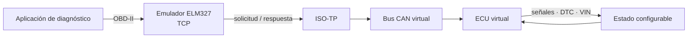
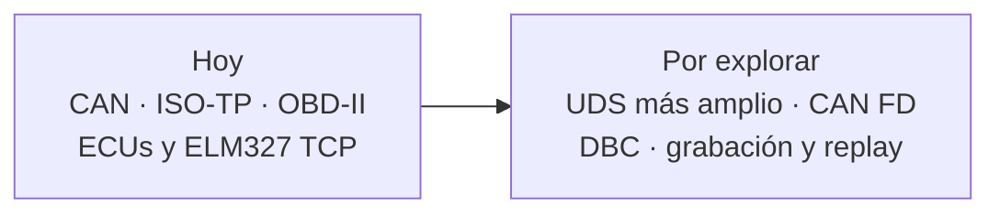

<div align="center">

# ECUSDK

### Un banco de pruebas virtual para software automotriz

Simula ECUs y conversa con ellas usando CAN, ISO-TP y OBD-II, sin depender de un vehículo físico.

**Creado por Rodar · Hecho para compartir con la comunidad**

[](https://www.python.org/)
[](#estado-del-proyecto)
[](./LICENSE)

</div>

ECUSDK es una herramienta interna de Rodar que ponemos a disposición de la comunidad para construir y probar software automotriz en un entorno controlado. Define un vehículo virtual con señales y ECUs configurables, y prueba el intercambio de diagnóstico a través de protocolos vehiculares.

La meta es simular lo que una aplicación puede observar en la comunicación con el vehículo: ECUSDK no ejecuta firmware original ni intenta reproducir el hardware interno de una ECU.

## Cómo funciona

Una aplicación puede consultar el vehículo simulado por OBD-II. La petición viaja por ISO-TP y CAN hasta la ECU virtual, que responde según su configuración y estado actual.



El mismo núcleo permite trabajar directamente con buses virtuales desde Python o conectar una interfaz SocketCAN explícita en Linux.

## Empieza en un minuto

Necesitas Python 3.11 o posterior. Desde el repositorio, instala ECUSDK en modo editable:

```bash
python -m pip install -e .
```

Consulta las RPM definidas en el ejemplo incluido:

```bash
ecusdk run examples/demo-car.toml --request "01 0C"
```

La salida contiene la respuesta ISO-TP en hexadecimal (`04 41 0C 0D 48`; los primeros cuatro bytes de payload son la respuesta OBD-II y representan 850 rpm). Para iniciar el servidor ELM327 sobre TCP en `127.0.0.1:35000`:

```bash
ecusdk run examples/demo-car.toml
```

La aplicación cliente debe enviar comandos ELM327 terminados en retorno de carro (`\r`). También puedes ejecutar una consulta de una sola vez sin iniciar el servidor:

```bash
ecusdk run examples/demo-car.toml --request "01 0D"
```

## Configura un vehículo

El formato TOML describe el bus, las ECUs, sus señales iniciales y la asociación entre PIDs OBD-II y señales. Este fragmento corresponde a [`examples/demo-car.toml`](./examples/demo-car.toml):

```toml
[vehicle]
name = "demo-car"
vin = "ECUSDK00000000001"

[buses.powertrain]
type = "can"
bitrate = 500000

[ecus.ecm]
bus = "powertrain"

[ecus.ecm.can]
request_id = 0x7E0
response_id = 0x7E8

[ecus.ecm.signals.rpm]
initial = 850

[ecus.ecm.signals.speed]
initial = 0

[ecus.ecm.obd]
"01:0C" = "rpm"
"01:0D" = "speed"
```

La señal `rpm` alimenta el PID `01 0C`; al cambiar el estado de la ECU, la respuesta refleja el nuevo valor. Puedes definir varios buses y ECUs en un mismo vehículo.

## Qué incluye

| Área | Disponible hoy |
| --- | --- |
| CAN | Bus virtual con nodos, filtros y timestamps; SocketCAN en Linux mediante interfaz explícita |
| ISO-TP | Direccionamiento normal, envío segmentado, Flow Control, bloques, STmin y timeouts |
| OBD-II | Mode 01 para RPM/velocidad; Mode 03 para leer DTCs; Mode 04 para borrarlos; Mode 09 PID 02 para VIN |
| Simulación | Estado y señales por ECU, reloj virtual y escenarios deterministas desde la API Python |
| Adaptador | Emulador ELM327 sobre TCP; transporte pseudo-terminal disponible en plataformas compatibles |
| Herramientas | API Python tipada y CLI `ecusdk run` |

Para conocer los detalles de los protocolos, límites y ejemplos de la API, consulta la [guía de protocolos](./docs/protocols.md).

## Casos de uso

- Desarrollar una integración de diagnóstico antes de tener acceso a un vehículo.
- Reproducir consultas y respuestas de forma determinista durante el desarrollo.
- Probar lectura y borrado de DTCs, señales y datos de identificación del vehículo.
- Conectar clientes compatibles con ELM327 a un emulador por TCP.
- Usar un bus virtual en pruebas automatizadas o conectar SocketCAN en Linux cuando haga falta.

## Alcance y estado

ECUSDK se encuentra en una etapa experimental (`0.1.0.dev0`). Las interfaces y la configuración pueden evolucionar. La implementación actual cubre un núcleo funcional de CAN, ISO-TP, OBD-II y simulación; las capacidades de UDS más amplio, CAN FD, importación DBC, grabación y reproducción todavía forman parte de ideas futuras.

El simulador modela comportamientos observables del protocolo. No emula firmware de fabricantes, un runtime AUTOSAR completo ni los componentes electrónicos de una ECU. SocketCAN requiere Linux y una interfaz preparada por quien ejecuta la herramienta.



## Contribuye

ECUSDK se comparte para que más personas puedan experimentar, reportar problemas y aportar mejoras. Puedes abrir un issue para describir un caso de uso o enviar una pull request con cambios acotados y una explicación de cómo reproducirlos.

Son especialmente útiles los ejemplos pequeños, las correcciones de protocolo y los perfiles de vehículos ficticios o genéricos. Evita incluir datos identificables de vehículos o información propietaria.

## Uso responsable

El entorno virtual está orientado a desarrollo, aprendizaje y pruebas. El bus predeterminado es virtual. SocketCAN abre únicamente la interfaz configurada de forma explícita. Al trabajar con hardware, hazlo en un banco de pruebas seguro y autorizado; no conectes pruebas experimentales a un vehículo en circulación.

## Licencia

ECUSDK se distribuye bajo **PolyForm Noncommercial License 1.0.0**. La licencia permite los usos no comerciales definidos en sus términos; el uso comercial requiere una licencia independiente de Rodar. Lee el texto completo en [`LICENSE`](./LICENSE).

## Rodar

ECUSDK es desarrollado por [Rodar](https://rodar.cl) y se comparte con la comunidad como herramienta para aprender, experimentar y construir mejor software automotriz.

© 2026 Rodar
